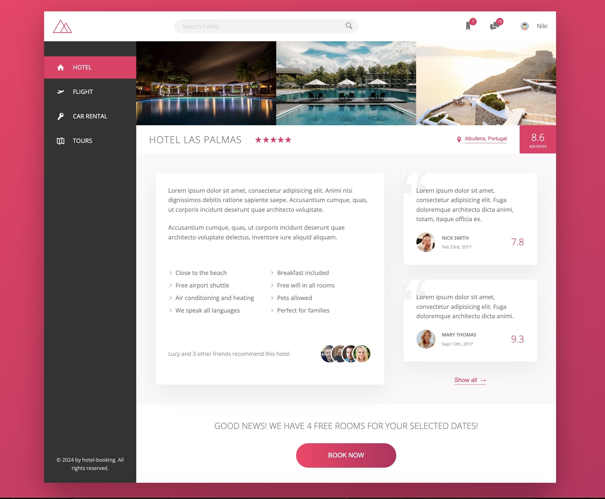

# Booking Hotels

Booking Hotels is a dynamic, user-friendly web application designed for booking hotels, allowing users to leave comments and rate their experiences. Built with HTML5 and SASS, it aims to provide an intuitive and engaging platform for travelers to find and book their ideal hotel stay, while also sharing their experiences through ratings and reviews.

## Features

-   **Hotel Search**: Users can search for hotels based on location, availability, price, and more.
-   **Booking System**: A seamless booking process that allows users to reserve their stay directly through the site.
-   **User Comments and Ratings**: After their stay, users can leave feedback in the form of comments and a 1-5 star rating.
-   **Responsive Design**: Crafted with HTML5 and SASS, the UI is fully responsive and optimized for all devices.
-   **User Authentication**: Secure login and registration system for managing bookings and reviews.



## Getting Started

These instructions will get you a copy of the project up and running on your local machine for development and testing purposes.

### Prerequisites

What things you need to install the software and how to install them:

### Installing

A step-by-step series of examples that tell you how to get a development environment running:

1. Clone the repository to your local machine:

```bash
git clone https://github.com/yourusername/HotelBooker.git
cd HotelBooker


```

npm install,
npm run start
